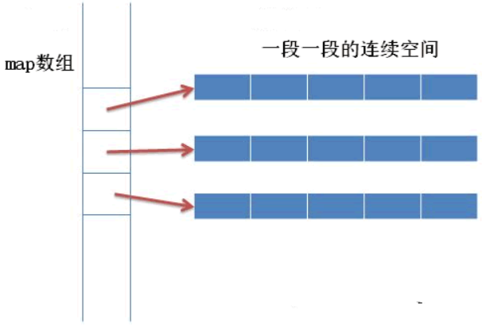
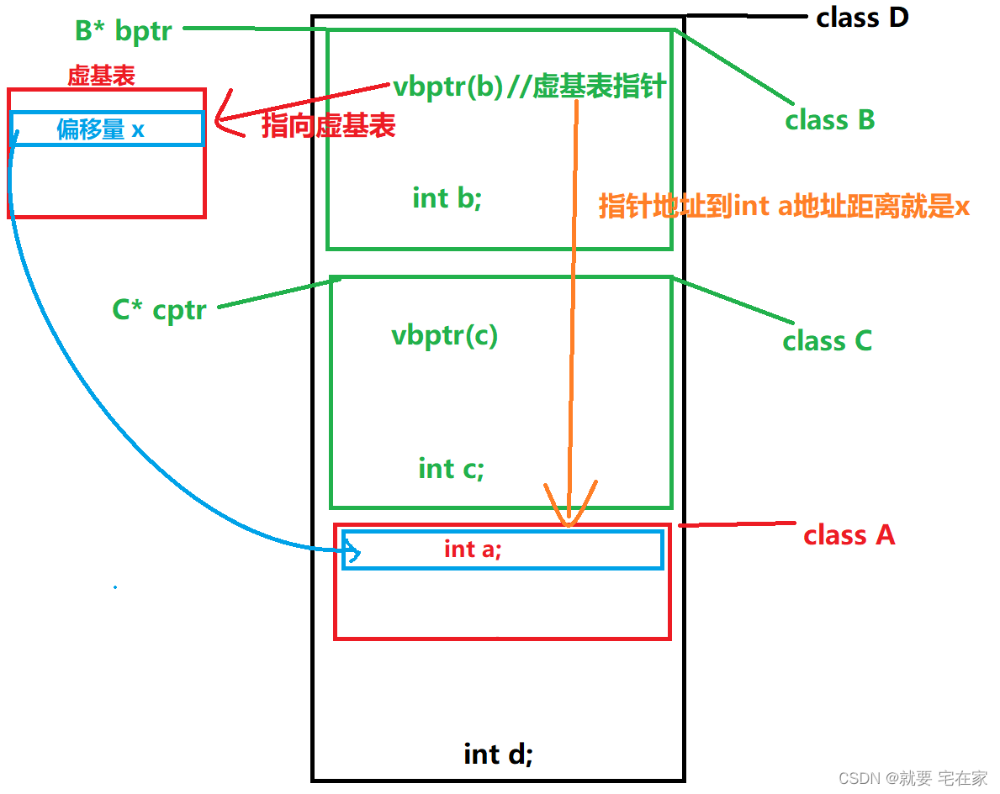

### C与C++
1. C面向过程，是结构化的程序设计语言。
2. C++面向对象，具有继承、多态和封装的特性。

### 编译过程
1. 预处理
    - 去掉注释
    - 宏替换  
    - 头文件展开
        - 将头文件内容拷贝到当前文件，避免重复拷贝就使用progma once或者define ... ifdef ... endif这种形式
    - 输出.i文件
2. 编译
    - 由编译器（gcc）完成，生成汇编文件（.s）
3. 汇编
    - 由汇编器（as）完成，生成目标文件（.o）
4. 链接
    - 由链接器（ld）完成，生成可执行文件
        - .o、.a、.so都属于ELF格式文件，可以通过readelf进行查看
        - ELF文件记录了符号表、段表这些信息
        - 链接就是将符号表、段表进行合并，做符号解析，某些符号需要找到定义它的位置，否则就会报链接错误；创建程序到虚拟地址空间的映射（4G虚拟内存，代码段和只读常量、数据段、bss段、堆区、内存映射段、栈区、内核空间）；符号重定位，编译产生的符号地址是无效的，需要给每个符号创建虚拟空间上的地址。

### 指针&引用
1. 指针存的是对象地址，本身是变量，可以更改
2. 引用是给变量起别名，一经初始化，不可更改绑定
3. 如果确认只是使用某个变量的别名，就使用引用；如果只是暂时指向某个变量，有可能还会指向其他变量甚至需要为空时，就使用指针。

### static
1. 修饰全局变量
2. 修饰局部变量，该变量只初始化一次，生命周期直到程序结束
3. 修饰普通函数，该函数仅在该文件中使用，外部文件不能访问
4. 修饰成员变量，该变量在第一次创建对象时初始化，且与其他对象共享该变量，只有一份存储，可以通过类名访问，也可以通过对象访问。
5. 修饰成员函数，该函数只能访问静态成员变量和调用静态成员函数，可以通过类名进行访问。

### const
1. 修饰普通变量，表示该变量不可更改
2. const int *p和int * const p含义不同，前者修饰指向的对象，后者修饰指针；类似的还有const int * const p
3. 修饰成员变量，该变量已经初始化，不可更改
4. 修饰函数返回值，一般返回一个常引用，表示只读
5. 修饰函数本身，表示该函数只能对成员变量进行读操作，以及只能调用常成员函数。

### volatile
1. 编译器优化有可能将某个变量a放入寄存器，这就导致存在这样一个问题：第一次从内存读取a，然后放入寄存器，后面继续访问时，就会从寄存器访问，当由于某种原因导致内存中的a被修改时，从寄存器将读取未更新的值。
2. 被修饰的变量不再被编译器进行优化，每次都从内存中获取值
3. 使用场景：
    - 多线程下，共享的标识符
    - 存储器映射的硬件寄存器通常也要加volatile说明，因为每次对它的读写都可能由不同意义
    - 中断服务程序中修改的供其它程序检测的变量需要加volatile

### mutable
1. 由于const成员函数无法修改成员变量，但是某些场景下需要进行修改，而mutable修饰的成员变量，可以在const成员函数中被修改。
2. 使用场景：
    - 多线程下，再使用互斥锁时，使用mutable修饰互斥锁成员变量，在const成员函数中就可以获取锁，从而实现现场安全。
    - 一般，不影响对象状态的成员变量可以使用mutable进行修饰，从而在const成员函数中进行写操作。

### 容器
#### vector
##### 1. emplace
```
// vector::emplace
#include <iostream>
#include <vector>

int main ()
{
  std::vector<int> myvector = {10,20,30};

  auto it = myvector.emplace ( myvector.begin()+1, 100 );
  myvector.emplace ( it, 200 );
  myvector.emplace ( myvector.end(), 300 );

  std::cout << "myvector contains:";
  for (auto& x: myvector)
    std::cout << ' ' << x;
  std::cout << '\n';

  return 0;
}
```
在指定位置上添加一个元素，并返回该元素的迭代器。它会导致其后的迭代器失效。

##### 2. empalce_back
```
#include <iostream>
#include <vector>

int main ()
{
  std::vector<int> myvector = {10,20,30};

  myvector.emplace_back (100);
  myvector.emplace_back (200);

  std::cout << "myvector contains:";
  for (auto& x: myvector)
    std::cout << ' ' << x;
  std::cout << '\n';

  return 0;
}
```
不同于push_back，emplace_back会使用传入的元素构造对象，而不是先创建临时对象。

##### 3. 动态扩容
- 从空间角度：扩容因子越大，预留的空间越大，浪费的空间就越多。
- 从时间角度：扩容因子越小，扩容的次数就越多，时间开销就越大。
- 假设扩容因子为2，每次扩容情况为：1,2,4,8,16,32……。当我们释放了4的空间，然后寻找8的新空间，再次扩容，释放8，寻找16的空间。显然1+2+4+8=15<16，也就是上次释放的空间永远也不能被下一次扩容利用，这对内存非常不友好，比如造成内存碎片等问题。而当k=1.5时则可以避免这种情况。理论上最佳扩容因子为黄金分割率，即1.618.
- 倍数增长（1.5或2）平摊复杂度为O(1)
- 1.5倍最大化利用内存，节省内存空间；2倍节省时间
- windows下vs是1.5倍系数，因为windows的堆管理器会将相邻的空闲块进行合并，如此再次扩容时就可以利用上一次释放的内存块，减少内存碎片
- linux下g++是2倍系数，伙伴系统将整个内存区域构建成基本大小的1倍、2倍、4倍等，即2的整数次幂，那么在申请和释放内存的时候就可以通过取对数向上取整的哈希算法快速找到对应的内存块。

#### list
- 双向链表
- 插入、删除快，随机访问性能差
- 适用于频繁插入和删除，但随机访问少
- 删除某个迭代器后其他迭代器不受影响

#### Queue，deque&priority_queue
- queue是队列，通过循环数组实现，注意获取队首元素是通过front函数。显示队尾使用back函数。
- deque是双向队列。是可以在两端扩展和收缩的连续容器。Deque容器使用分段数组来存放数据，将每一段的连续空间的首地址存放在索引表中，当头部或者尾部的数组空间满时，就会重新分配一个数组，然后在索引表的头部或尾部添加新的数组首地址。deque的操作有push_front和push_back。back和front分别用来获取队尾和队首元素。

- priority_queue是基于堆实现。定义priority_queue<type, container, func>。分别传入关键字类型，存放数据的容器和比较函数。当使用基本数据类型时，只需要传入数据类型即可，默认为大根堆。获取队首元素使用top函数。操作有push和pop。

#### pair&tuple
- pair是将2个数据组合成一个数据。他可以作为map的元素。使用first和second可以获取这两个元素值。make_pair函数可以定义一个pair类型变量。如make_pair(1, 1)。也可直接使用pair<int, int> p(1, 1)。map、unordered_map中的元素就可以通过pair的形式来获取。
- tuple可以将多个数据组合成一个数据。比如auto t = make_tuple(1, “2”, 1.1, ‘3’);以通过get来获取每个位置的值。如get<0>(t)的值就是1。还可以基于类型，但保证类型唯一，如get<char>(t)的值就是’3’。

#### map & set
##### 0. RB-Tree
- 与AVL树不同的是，AVL树满足任意节点的两个子树的高度差不大于1，而红黑树最长路径不超过最短路径的2倍，所以是近似平衡的二叉搜索树。
- 由于AVL树的平衡性过于严苛，为了保证平衡性，需要做旋转操作，所以频繁地插入开销比较大，而红黑树既满足log(n)的查找复杂度，又减少了频繁插入带来的计算开销。
- 红黑树的五个特性
    - 节点是红色或者是黑色
    - 根节点是黑色
    - 每个叶节点（NIL或空节点）是黑色
    - 不存在两个连续的红色节点
    - 从任一节点到其没个叶节点的所有路径都包含相同数目的黑色节点
    - [红黑树参考](https://blog.csdn.net/Y0Q2T57s/article/details/111601963)

##### 1. key_compare & value_comp
- key_compare：比较器类型。
```
map<int, int> my_map;
map<int, int>::key_compare my_comp = my_map.key_comp();
my_comp(1, 2); // 返回true
```
- value_comp：返回比较器对象，参数时pair对象
```
std::map<char,int> mymap;
mymap.value_comp()(*mymap.begin(), *mymap.rbegin()); // 返回ture
```

##### 2. emplace & emplace_hint
```
map<int, string> my_map;
ret1 = my_map.emplace(1, "abc"); // 直接使用abc进行string对象构造
my_map.insert({1, "cdb"}); // 先创建string(cdb)临时对象，再调用移动构造函数
ret2 = my_map.emplace_hint(my_map.end(), 1, "abc");
// emplace和emplace_hint的返回值是一个pair<map::iterator, bool>
// first为被插入元素的迭代器，second为插入是否成功（key已存在，则插入失败）
```

##### 3. lower_bound & upper_bound
- lower_bound(k)，返回第一个不在k之后的迭代器，即<=k的第一个key
- upper_bound(k)，返回第一个在k之后的迭代器，即>k的第一key

#### unordered_map & unordered_set
- 底层实现为哈希表，所以查询和插入是常数开销，但是当数据量很大时，可能会产生很多冲突，致使性能降低。需要解决冲突。
    - 拉链法，在冲突的位置创建链表，相同哈希值的元素插入到链表中
    - 线性探查法：从冲突位置开始往后遍历，直到找到空闲位置
    - c++使用拉链法解决哈希冲突，不同的是，并不是每一个槽位有一个独立的链表，而是所有槽位公用一个链表，插入时使用头插法，每一个槽位都指向上一个槽位的尾结点，即当前槽位首结点的前一个结点。

### 类
#### 权限
1. public
2. potected
  - 类外不可见
  - 对子类可见
  - 子类拥有同样权限
3. private
  - 类外不可见
  - 对子类不可见，但占用空间

#### struct & class
1. struct多用于数据结构，默认权限为public
2. class可用于模板中，声明类型变量

#### static & non-static
- static成员具有共享的属性，即只有一份存储，可通过对象访问，也可直接通过类访问
- static函数只能访问static成员

#### const
- const成员，在构造的时候初始化，之后不可更改
- const函数，只能对成员进行读操作

#### 构造函数&析构函数
- 父类的析构函数必须是虚函数
- 构造/析构函数函数不存在时，会默认生成

#### 拷贝构造、赋值运算符
- 拷贝构造，故名思意，是将其他对象的内容拷贝了一份
- 赋值运算符实现时，注意是否赋值的自身，并返回对象的引用
- 大三律：拷贝构造函数、赋值运算符、析构函数应同时显示声明，否则只存在其中一个，拷贝构造函数和赋值运算符将不会默认生成。

#### 移动拷贝构造、移动赋值运算
- 移动拷贝构造，被拷贝的对象是一个右值
- 移动赋值运算符，被赋值的对象是一个右值
- 若赋值运算符、拷贝构造和移动复制有一个显示声明了，另外的移动复制就不会默认生成

#### 重载、覆盖、重写
- 重载，同名，但参数类型，个数等不同
- 覆盖，子类拥有同名函数，有自身的实现
- 重写，子类重写虚函数

#### 虚函数&多态
- 多态，函数重载和虚函数
- 子类继承父类，并重写父类的虚函数，然后通过父类指针来访问该虚函数
  - 原理：创建对象时，会生成一个虚表指针，该指针指向虚函数表，虚函数表中存放该对象的虚函数地址。
  - 因此一个拥有虚函数的类，至少存储一个8字节的虚表指针

#### this
- 对象调用成员函数时，隐式传入的一个指向该对象的指针

#### 初始化列表
- 构造函数中，常使用初始化列表来初始化一些成员，顺序和成员在代码中的顺序一致

#### 友元
- 友元函数，该函数用类的全部权限
- 友元类，该友元类拥有类的全部权限
- 破坏了类的封装

#### 单继承、多继承
- 继承父类的成员与方法，但private权限对子类不可见
- 菱形继承问题
```C++
class A {
public:
    int x;
    int y;
};
class B: public A {
public:
    int t;
};
class C: public A {
public:
    int s;
};
class D: public B, public C {
public:
    int z;
};
```
上述继承关系就是菱形继承，其中B和C分别继承了A，那么x和y在B和C中各有一份，当D再继承B和C是，对于D的对象而言，它存储了两份x和y，在使用上既造成了空间浪费，又造成了歧义。通过虚继承的方式可以解决这种问题。
```C++
class A {
public:
    int x;
    int y;
};
class B: virtual public A {
public:
    int t;
};
class C: virtual public A {
public:
    int s;
};
class D: public B, public C {
public:
    int z;
};
```
上述通过虚继承的情况下，D对象中，B和C的成分存放的不再是基类的成员而是一个指向虚基表的指针，虚基表中存放的是指针相对基类成员的偏移量。如下图所示：\



#### 对象模型

### new、delete、delete[]
- new动态创建内存，并调用类的构造函数进行成员初始化
- delete与new配合使用，析构成员，并释放内存
- delete[]与new配合使用，调用每个对象的析构函数，最后释放内存
- 如果创建的是对象数组，但是释放时调用的不是delete[]，那么内存将会被全部释放，但对象只析构了一个

### 左值&右值
- 左值，可以取地址的，有名字的值
- 右值，不可以取地址或者没有名字，比如表达式，函数的返回值等
- 可以通过std::move()来转化左值为右值

### 完美转发&移动语意思
- 移动语义
```C++
class Widget;
void func(Widget&& k) {
    other_func(std::move(k));
}
```
上述参数为右值引用，在明确为右值引用的情况下，应该使用std::move来使用右值的特性，因为形参本身是左值，若不强转，就会按左值传递下去。

- 万能引用
```C++
template<class T>
void func(T&& param){
    other_func(std::forward<T>(param));
}
```
形如上述模版函数中的引用即为万能引用，形参可以绑定任何类型。实参为左值或左值引用，推导的类型就是左值引用；实参为右值或右值引用，推导的类型就是右值引用。由于param是万能引用，所以在传参给其他函数时，并不知道其为左值还是右值，若是右值就需要强制转化成右值再传参，若是左值就应该传递左值。此种情况下不适合使用std::move直接强转，而std::forward根据编译期传递的信息，可以实现按实参类型转化或者不转化。

### 智能指针
- unique_ptr，独享智能指针，所有权只能被一个对象拥有，不可以被拷贝，赋值，但可以被剥夺所有权
- shared_ptr，共享智能指针，所有权可以被多个对象共享，可以拷贝和赋值，依赖引用计数器，计数器为0时，释放内存
- weak_ptr，对shared_ptr的补充，需要依赖shared_ptr进行创建，不占用引用计数，可以解决**shared_ptr循环引用**的问题

### 闭包
- TODO

### 内存管理
- TODO
