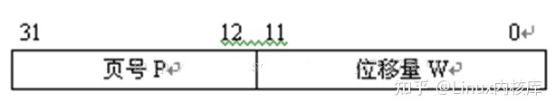
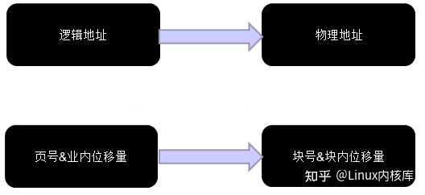
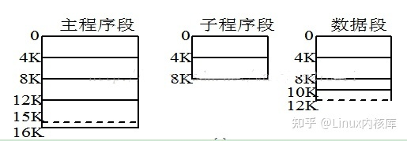
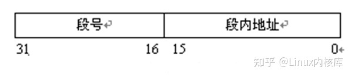
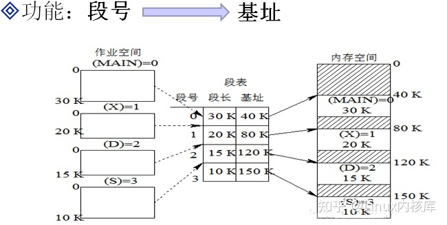
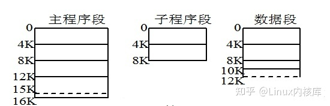
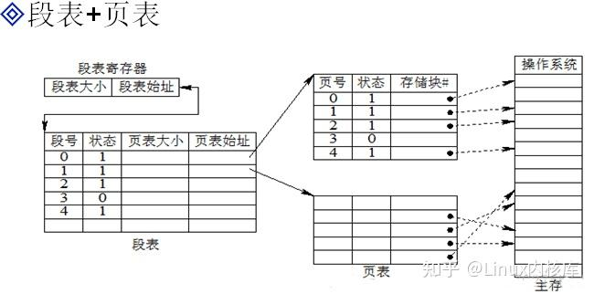

### 进程
1. 进程控制块
    - 进程id。用pid_t类型表示。
    - 进程状态。就绪、运行、阻塞和终止。
    - 进程切换时要保存和恢复的一些寄存器。
    - 描述虚拟地址空间到物理地址的映射关系。
    - 当前进程工作目录。
    - umask掩码。
    - 文件描述符。
    - 和信号相关的信息。
    - 用户id和组id。
    - 会话和进程组。
2.	进程控制原语
    - 创建进程：
		   - 执行一个可执行文件。
		   - 在程序中执行fork或vfork函数创建子进程。父进程返回子进程的pid，子进程返回0。
    - 获取进程id
    - getpid()获取当前进程的pid。
    - getppid()获取父进程pid。
3.	exec函数簇
	调用该函数后会将当前进程的代码段和数据段替换成所要加载程序的代码段和数据段。并进入加载后的程序执行，不再返回，只有失败才会返回-1。

4. 孤儿进程、僵尸进程和守护进程
    - 孤儿进程是指当一个子进程的父进程先于子进程退出，此时子进程就变成了孤儿进程，然后init进程就会接管该进程成为其父进程。
    - 用fork创建子进程，当子进程退出时，父进程没有调用wait或waitpid函数来获取子进程的状态信息。那么子进程的进程描述符仍然保存在系统中，成为僵尸进程，进程号将一直被占用。
    - 守护进程就是一直在后台运行的进程。创建守护进程如下。
    - fork创建子进程，父进程exit()退出。使得进程脱离控制终端。之后所有的工作都在子进程中完成。
    - 在子进程调用setsid()创建新会话。子进程成为新会话的首进程。使得当前进程脱离原会话、原进程组、原控制终端的控制。
    - 在子进程中调用chdir()让根目录成为子进程的工作目录，防止占用可卸载的文件系统，如/mnt/usb。
    - 在子进程中调用umask重设文件权限掩码为0。文件权限掩码是指屏蔽掉文件权限中的对应位。由于子进程会继承父进程的文件权限掩码，所以需要重设为0，即清除掩码，这样可以增强守护进程的灵活性。
    - 在子进程关闭不需要的文件描述符。文件描述符0,、1和2也失去了存在价值，一般重定向到/dev/null。
    - 执行守护进程核心工作。
    - 守护进程中需要编码来实现kill发出的signal信号处理，达到进程的正常退出。
    - linux提供daemon(int nochdir, int noclose)函数用于创建守护进程，实现原理同上。nochdir为0时，改变进程目录为根目录。noclose为0时，将0,1,2重定向到/dev/null中。一般使用如下：
```
Int main() {
    daemon(0, 0);
	   /*在此添加需要在后台运行的程序*/
}
```
6. 进程间通信
- 管道：pipe(int *fds)函数创建一个管道，其中fds[0]为读端，fds[1]为写端。一般为了实现全双工，会创建两个管道，父进程有一个读端和一个写端，子进程有一个写端和一个读端。
- socket通信，全双工通信，详见网络编程
- 消息队列，消息队列是消息的链表，存放在内核中并由消息队列标识符标识。它提供了一个从一个进程向另一个进程发发送数据块的方法，每个数据块都可以被认为是一个类型。
    - 生命周期随内核，消息队列会一直存在；消息队列可以双向通信；克服了管道只能承载无格式字节流的缺点。
    - int msgget(key_t key, int msgflag)函数创建和访问一个消息队列。其中key是某个消息队列的名字，用ftok()产生。msgflag有IPC_CREAT和IPC_EXCL两个选项，单独使用第一个选项，那么如果消息队列不存在就会创建一个，否则打开消息队列并返回；单独使用第二个选项没有意义；两个同时使用，如果消息队列不存在则创建之，如果存在则出错返回。
    - key_t ftok(const char*pathname, int proj_id)函数调用成功返回一个消息队列的标识码，失败返回-1。
    - int msgctl(int msqid, int cmd, struct msqid_ds* buf)消息队列控制函数，cmd有三个选项，IPC_STAT，设置buf中数据为消息队列当前的关联值；IPC_SET；IPC_RMID删除消息队列。成功返回0，失败返回-1。
    - msgsnd(msqid, msg, size, msgflag\/\*默认0*\/)/msgrcv(msqid, msg, size, msgflag)向消息队列添加消息，成功返回0/从消息队列接收消息，成功返回接收的字节数。
- 共享内存：mmap映射
    1. 在非血缘进程间通信，只需要打开或创建一个文件，然后通过mmap将其映射到内存。就可以通过对映射的内存进行操作，实现内存共享。
    2. 父子进程之间可以通过匿名映射来实现，因为映射的内存是由父子进程共享的。
- 信号
	1. 每个进程收到的信号都是由内核负责发送和处理的。Linux下有64个信号。
	2. 信号产生的方法：按键产生、系统调用、软件条件产生、硬件异常、命令产生。
	3. signal(信号名，处理动作)。其中处理动作函数参数为int，返回为void。注册信号捕捉函数。
	4. sigaction()，可以设置信号屏蔽，比如自动屏蔽本信号。
	5. 内核实现信号捕捉的过程：如果信号处理动作是自定义的处理函数，那么进入用户模式执行处理函数，信号处理函数返回时，执行系统调用sigreturn再次进入内核。然后返回用户模式继续执行下一条指令。
	6. 时序竞态：设备或系统出现不恰当的执行时序，而得不到正确的结果，导致该到达响应的信号没有被响应。解决方法：可重入函数内不能含有全局变量及static变量，不能使用malloc、free。信号捕捉函数设置成可重入的。举例：比如我定时1秒钟然后调用pause挂起等待sigalrm信号唤醒。但是在此期间当前进程失去CPU，内核调度优先级高的进程取代当前进程。1秒后，闹钟超时，内核向当前进程发生SIGALRM信号，由于当前进程仍处于就绪态，信号无法处理即未决。待高优先级的进程执行结束，当前进程进入运行态，SIGALRM信号递达，执行处理函数。信号处理函数执行结束，返回当前进程主控流程，pause被调用挂起等待。欲等待alarm函数发送SIGALRM信号将自己唤醒。但是SIGALRM信号以及处理结束，程序会被永久挂起。

### 线程
1. 线程共享资源
    - 文件描述符表。
    - 每种信号的处理方式。
    - 当前工作目录。
    - 用户ID和组ID
    - 代码段、数据段、bss段个堆区
2. 线程非共享资源
    - 线程id
    - 栈空间
    - 寄存器
    - 指令计数器
    - 信号屏蔽字
    - 调度优先级
    - errno变量
3. 线程优缺点
    - 优点：提高程序并发性，开销小，线程通信、共享数据方便。
    - 缺点：库函数不稳定。调试、编写困难。对信号支持不好。线程间会相互干扰。如一个线程挂掉，会导致整个进程的线程全部挂掉。
4. 线程控制原语
    - pthread_create函数
	     - 创建一个新线程，传入参数为线程id，线程属性和线程处理函数以及处理函数的参数。
       ```C
	     Pthread_create(pthread_t *thread, const pthread_attr_t* attr, void*(*func)(void*), void* arg)
       // 上述函数成功返回0，失败返回错误号。可用strerror来打印。
       // 创建线程的时候参数最好使用值传递。
       // pthread_self()返回线程id。
       // pthread_exit()或return用来退出线程。若用exit则会退出整个进程。
       ```
    - Pthread_join()函数。
      - 阻塞等待线程退出。成功返回0，失败返回错误号。
    - pthread_detach()函数
	    - 设置线程分离。
    - 线程属性设置
	    - Pthread_attr_t结构体主要成员：1.线程分离状态；2.线程栈大小；3.线程栈警戒缓冲区大小。通过pthread_attr_setdetachstate和pthread_attr_setstacksize等函数实现属性设置，不能直接设置。
5. **线程同步**
<p>线程间共享数据时，就会出现数据竞争，这种情况下，计算结果很难预知，大概率和期望的结果不一样，因此需要进行线程同步。线程间同步的方式主要有以下几种：

    - **互斥锁：**同一时刻只能有一个线程能够获取该锁，当其他线程试图获取该锁时，就会阻塞而进入休眠状态。
    - **条件变量：**如果线程需要等待某个条件产生，比如队列中有数据时，此时互斥锁不适用，因此就有了条件变量，当条件不满足时，线程进入休眠状态，当条件满足时，再唤醒线程。
    - **读写锁：**读共享，写独占，适用于读多，写少的场景，提高并发度。
    - **信号量：**区别于互斥锁，信号量允许多个线程进入临界区，能允许的线程数取决于信号量的大小。对信号量的操作成为pv操作，p为获取，v为释放。
</p>

  <p>线程间同步，处理不当的情况下，会出现一个严重的问题，即**死锁**，死锁产生的原因主要有以下几种：

    - **互斥条件：**一段时间内某个锁资源只能被一个线程所占用。
    - **请求和保持条件：**指一个线程已经保持至少一个资源，但又提出了新的资源请求，而该资源被其他线程所占用，此时会阻塞，但又不会释放已占用的资源。
    - **不可剥夺条件：**已获得的资源，在未使用完之前，不能被剥夺。
    - **环路等待：** 指在发生死锁时，必然存在运算单元和资源的环形链，即 运算单元正在等待另一个运算单元占用的资源，而对方又在等待自己占用的资源，从而造成环路等待的情况。

  因此只要破坏上述四个条件中的一个，就可以解决死锁。</p>

  造成死锁的场景有：**加锁后未释放**、**重复加锁**

6. **CAS**
<p>Compare and Swap(CAS)是一种无锁算法，类似于一种无阻塞多线程争抢资源的模型。CAS机制当中有3个操作数：V:内存地址、A:旧的预期值、B:新值。</p>
<p>一个线程更新内存地址的一个变量的时候，当变量的预期值A和内存地址V当中的实际值相同时，就会认为没有其他线程修改过，就将内存地址V对应的值修改为B，反之则认为有其他线程修改过，放弃此更新操作，重复尝试获取内存地址值，直至修改成功。</p>
<p>CAS是一种乐观锁，他会假设对资源的访问是没有冲突的，因此线程不需要阻塞。</p>
<p>ABA问题：线程1获取内存地址V得到预期值为"A"之后，线程2对内存地址V的值进行修改成"B"，线程3对内存地址V的值进行修改成"A"，导致线程1修改的时候判断内存地址V的值和预期值"A"相等，认为没有线程修改过内存地址V，就会对内存地址V的值进行修改，
并不能感知到有其他线程修改过的痕迹</p>
<p>ABA问题带来的危害：如果系统只在乎数值的正确性，那么不会有什么影响，但如果系统在乎数据的版本，也就是第一次的A和修改后的A不是同一个数据，那么就会出现问题，因此解决ABA问题，可以通过对目标数据增加版本号，版本号只能增加，所以不会出现ABA问题了。</p>

### 内存管理
#### 页式内存管理
- 一个进程被映射到虚拟内存后，其内存是连续的，然后将其按照固定大小（如4KB）分割成多个页，物理内存也会按照同样的方式划分成多个块，载入程序时，将物理内存与虚拟地址建立映射，存储在页表中，并用相应的硬件地址转换机构来解决离散地址变换问题。
- 优点：没有外碎片，每个内碎片不超过页的大小。
- 缺点：程序全部装入内存，要求有相应的硬件支持，如地址变换机构缺页中断的产生和选择淘汰页面等都要求有相应的硬件支持。增加了机器成本和系统开销。

##### 分页步骤
1. 逻辑地址等分为页，并从0开始编号
2. 内存空间等分为块，与页面大小相同，从0开始编号

- 分配内存时，以块为单位将进程中的若干个页分别装入到多个可以不相邻接的物理块中。

##### 地址结构
- 分为两部分：页号、位移量（业内地址）

- 业内地址的位数可以决定页的大小（如上图每页大小为4K）。
- 逻辑地址=页号&位移量（&号是连接符号，是将页号作为逻辑地址的最高位）

##### 地址映射（逻辑地址-->物理地址）
- 如图所示：（物理地址=块号&块内地址）

- 因为块的大小=页的大小，所以块内位移量=页内位移量，所以只需求出块号即可
- 块号由页表提供，页表记录了页号与块号的映射关系。

##### 地址变换原理及步骤
1. 在被调进程的PCB中取出页表始址和页表大小，装入页表寄存器
2. 页号与页表寄存器的页表长度比较，若页号大于等于页表长度，发生地址越界中断，停止调用，否则继续
3. 由页号结合页表始址求出块号
4. 块号&页内地址，即得物理地址

#### 段式内存管理
- 段式管理的基本思想是把程序按内容或过程函数关系分成段，每段有自己的名字。一个用户作业或者进程所包含的段对应一个二维线性虚拟空间，也就是一个二维虚拟存储器。段式管理程序以段为单位分配内存，然后通过地址映射机构把段式虚拟地址转换为实际内存物理地址。
- 优点：可以分别编写和编译，可以针对不同类型的段采取不同的保护，可以按段为单位来进行共享，包括通过动态链接进行代码共享。
- 缺点：会产生碎片。

##### 分段步骤
- 逻辑空间分为若干个段，每个段定义了一组有完整逻辑意义的信息（如主程序Main（）），如：

- 内存空间为每个段分配一个连续的分区
- 段的长度由相应的逻辑信息组的长度决定，因而各段长度不等，引入分段存储管理方式的目的主要是为了满足用户（程序员）在编程和使用上多方面的要求。
- 要注重理解，完整的逻辑意义信息，就是说将程序分页时，页的大小是固定的，只根据页面大小大小死生生的将程序切割开；而分段时比较灵活，只有一段程序有了完整的意义才将这一段切割开。

##### 地址结构
- 分两部分：段号、位移量（段内地址）

- 段内地址的位数可以决定段的大小
- 逻辑地址=段号&段内地址（&号是连接符号，是将段号作为逻辑地址的最高位）

##### 地址变换原理及步骤
1. 在被调进程的PCB中取出段表始址和段表长度，装入控制寄存器
2. 段号与控制寄存器的页表长度比较，若段号大于等于段表长度，发生地址越界中断，停止调用，否则继续
3. 由段号结合段表始址求出基址
4. 基址+段内地址，即得物理地址

##### 地址映射（逻辑地址--->物理地址）
- 求基址的过程与页式存储中求块号的过程原理相同，这里需要注意的是，物理地址是基址+段内地址，而不是基址&段内地址，由逻辑地址得到段号、段内地址，再根据段号和段表求出基址，再由基址+段内地址即可得物理地址。


#### 段页式内存管理
- 段页式管理，系统必须为每个作业或者进程建立一张段表以管理内存分配与释放、缺段处理等。另外由于一个段又被划分为若干个页，每个段必须建立一张页表以把段中的虚页变换为内存中的实际页面。显然与页式管理时相同，页表也要有相应的实现缺页中断处理和页面保护等功能的表项。
- 段页式管理是段式管理和页式管理相结合而成，具有两者的优点。
- 在页式、段式存储管理中，为获得一条指令或数据，须两次访问内存；而段页式则须三次访问内存

##### 步骤
- 用户程序先分段，每个段内部再分页（内部原理同基本的分页、分段相同）


##### 地址结构
- 分三部分：段号、段内页号、页内地址


##### 地址映射（逻辑地址--->物理地址）
- 逻辑地址----- >段号、段内页号、业内地址
- 段表寄存器--- >段表始址
- 段号+段表始址---- >页表始址
- 页表始址+段内页号----->存储块号
- 块号+页内地址------>物理地址


##### 地址变换原理及步骤
1. 在被调进程的PCB中取出段表始址和段表长度，装入段表寄存器
2. 段号与控制寄存器的页表长度比较，若页号大于等于段表长度，发生地址越界中断，停止调用，否则继续
3. 由段号结合段表始址求出页表始址和页表大小
4. 页号与段表的页表大小比较，若页号大于等于页表大小，发生地址越界中断，停止调用，否则继续
5. 由页表始址结合段内页号求出存储块号
6. 存储块号&页内地址，即得物理地址

### 用户线程与内核线程
- 线程的实现可以分为两类：用户线程和内核线程

#### 用户线程
- 用户级线程的实现就是把整个线程实现部分放在用户空间中，内核对线程一无所知，内核看到的就是一个单线程进程。
- 优点
    - 整个用户级线程的切换发生在用户空间，这样的线程切换至少比陷入内核要快一个数量级
    - 创建和销毁线程、线程切换代价等线程管理的代价比内核线程少得多, 因为保存线程状态的过程和调用程序都只是本地过程
    - 用户级线程有比较好的可扩展性，线程能够利用的表空间和堆栈空间比内核级线程多，这是因为在内核空间中内核线程需要一些固定的表格空间和堆栈空间，如果内核线程的数量非常大，就会出现问题，因为内核空间也是很有限的

- 缺点
    - 一个线程阻塞，会阻塞该进程中其他所有的线程
    - 如果一个线程开始运行，那么该进程中其他线程就不能运行，除非第一个线程自动放弃 CPU 。因为在一个单独的进程内部，没有时钟中断，所以不能用轮转调度（轮流）的方式调度线程。
    - 不像内核线程的调度那样，由时钟中断来控制，在用户线程中我们必须自己手动编写调度的代码，这会极大的增加我们代码的复杂度。

#### 内核线程
- 在内核中有一个用来记录系统中所有线程的线程表（TCB，进程表PCB），当某个线程希望创建一个新线程或撤销一个已有线程时，它进行一个系统调用，这个系统调用通过对线程表的更新完成线程的创建或撤销工作。

- 优点
    - 当一个线程阻塞时，内核根据选择，可以运行同一个进程中的其它线程或其他进程中的线程。
    - 由内核来调（借助于时钟中断），开发者无须关心调度的实现。

- 缺点
    - 在内核中创建和撤销线程的开销比较大，速度慢
