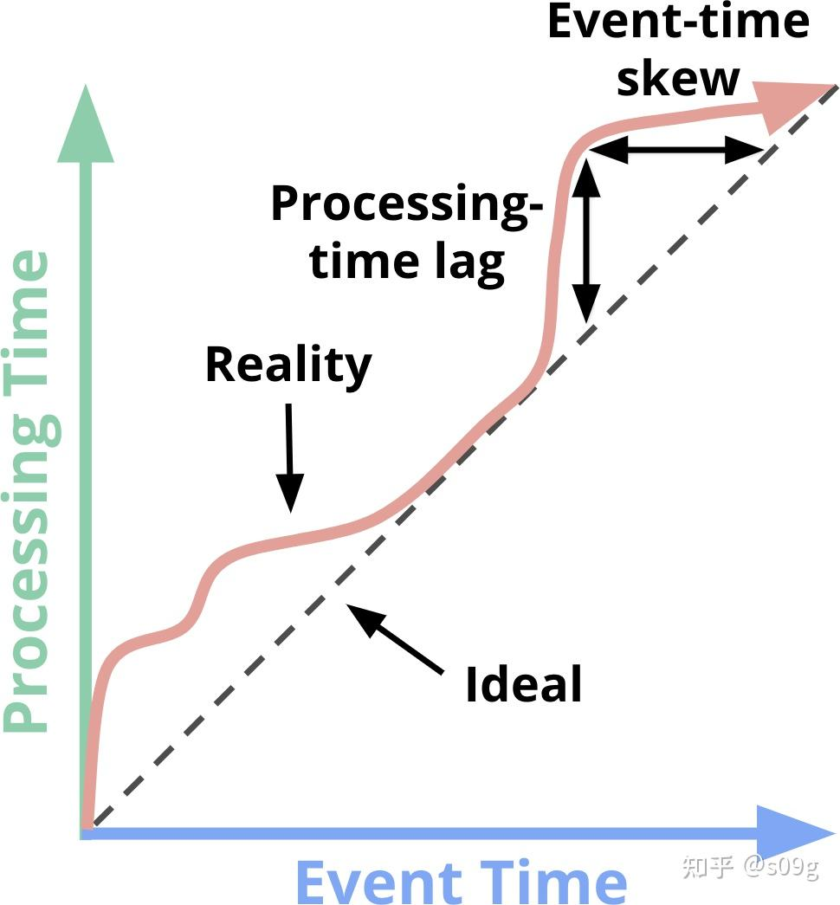

### [流式系统 Chapter 01. Streaming 101](https://zhuanlan.zhihu.com/p/540902592)
#### 什么是Streaming
设计良好的流式计算系统与任何现有的批处理引擎一样，能够产生正确的、一致的、可重复的结果。 

**流式计算:** 一种设计上考虑到了无限的数据集数据处理引擎 

一个数据集的状态由两个重要的（也是正交的）维度来定义：cardinality基数和constitution结构。 

基数决定了数据集的大小，最突出的特点是：   
- 有边界数据：大小有限的数据集
- 无边界数据：大小（至少在理论上）无限的数据集 

constitution结构定义了人们与数据交互的方式。一个直观的感受是，存在两个重要的主要结构:  
- **Table表** 给定时间点上的数据集的整体视角。传统上，SQL系统是以Table为单位进行处理的。
- **Stream流** 随时间演变，针对数据集逐个元素的视角。传统上，MapReduce一系的数据处理系统都是以流的形式处理数据。

#### 流式计算的局限性
流式计算系统一直被归入一个小众场景：提供低，一段时间后，批处理系统逐步提供正确的输出。

对于那些还不熟悉Lambda架构的人来说，其基本思想是，运行批处理系统时并行启动一个流式系统，两者执行基本相同的计算。流式系统给出低延迟、不准确的结果，一段时间后，批处理系统逐步提供正确的输出。

##### Batch和Streaming的效率差异
批处理和流式计算之间的效率差异主要得益于批处理系统中额外的捆绑（increased bundling）和更高效的shuffle传输。现代
处理系统实施了复杂的优化，允许用户使用不多的计算资源来实现到极高的吞吐量水平。我们可以把批处理系统经验迁移到为无边界数据设计的系统上，让用户灵活地选择高延迟、高效率的batch处理和低延迟、低效率的streaming处理。

##### Event Time Versus Processing Time 事件时间vs.处理时间
在任何数据处理系统中，通常有两个我们关心的时间域： 
- **事件时间 Event time：** 事件实际发生的时间
- **处理时间 Processing Time：** 系统观察到事件的时间
大多数（并非全部）使用场景需要关注事件时间。比如随着时间的推移对用户行为进行定性，大多数计费应用，以及各种类型的异常检测。 

理想的环境中，事件时间和处理时间总是一致的，事件一发生就被立即处理。然而，现实并非如此，事件时间和处理时间之间的偏差不仅不是零，而且往往是基于底层输入源、执行引擎和硬件等特性的可变函数。能够影响偏移水平的事情包括以下几点： 

理想的环境中，事件时间和处理时间总是一致的，事件一发生就被立即处理。然而，现实并非如此，事件时间和处理时间之间的偏差不仅不是零，而且往往是基于底层输入源、执行引擎和硬件等特性的可变函数。能够影响偏移水平的事情包括以下几点：
- 共享资源的限制，如网络拥堵、网络分区或非专用(nondedicated)环境下的共享CPU
- 软件原因，如分布式系统逻辑、纷争(contention)等
- 数据本身的特点，如密钥分发、吞吐量的差异或乱序。

因此，如果根据现实世界的系统中绘制事件时间对应处理时间的曲线，最终得到的东西通常看起来有点像图中的红线。

图1-1. Time-domain mapping 时间域映射。x轴代表系统中的事件时间完整性；也就是说，到事件时间中的X时间为止，所有事件时间小于X的数据都被观察到。y轴代表处理时间的进度；也就是数据处理系统执行时观察到的正常时钟时间。

#### Data Processing Patterns 数据处理模式
##### Bounded Data 有边界数据
处理有边界数据在概念上是很简单的，而且大家可能都很熟悉。在图1-2中，我们从左边开始有一个充满熵的数据集。我们通过一些数据处理引擎（通常是批处理，如果是设计良好的流处理引擎也行）来运行它，比如MapReduce，最后在右边有一个新的、更有用的结构化数据集。

图1-2. 用一个经典的批处理引擎进行有边界数据处理。左边的有边界非结构化数据池通过数据处理引擎运行，在右边产生相应的结构化数据。

##### Unbounded Data: Batch 无边界数据: 批处理
###### Fixed windows 固定窗口
使用批处理引擎的重复运行来处理无边界数据集，最常见的方法是将输入数据窗口化为固定大小的窗口，然后将每个窗口作为一个单独的、有边界的数据源来处理（称为tumbling windows滚动窗口），如图1-3。

然而，在现实中，大多数系统仍然有一个完整性的问题需要处理，如果一些事件由于网络分区而在写入到日志的途中被延迟了怎么办？

###### Sessions 会话
会话通常被定义为(对于一个特定的用户)活跃期，终止于一个不活跃的间隙。使用批处理引擎来计算会话时，会话常常会被分割成不同的批次，如图1-4中的红色标记所示。我们可以通过增加批处理量来减少分割的数量，但代价是增加延迟。另一个选择是增加额外的逻辑来拼接之前运行的会话，但代价是进一步的复杂性。

##### Unbounded Data: Streaming 无边界数据: 流处理
流式系统是为无边界数据而生。对于许多现实世界的分布式输入源，数据不仅无边界，而且具备以下特性：
- 在事件时间方面高度无序。如果用户要按照数据发生顺序分析，就需要在管道中进行某种基于时间的shuffle。
- 具有不定的事件时间偏差。用户不能预期在某个固定的时长Y内，看到给定事件时间X的大部分数据。 

在处理具有这些特征的数据时，可以采取一些技巧。我一般将这些方法分为四组：时间无关、近似算法、基于处理时间的窗口和基于事件时间的窗口。

###### Time-agnostic 时间无关
时间无关的处理用于时间不相关的场景，即所有的逻辑都是数据驱动的。基本上现有的所有流系统都支持时间无关的场景。批处理系统也很适合对无边界数据源进行时间无关的处理，只需将无边界数据源切成任意的有边界数据集序列，并独立处理这些数据集。

###### Filtering 过滤
想象一下，你正在处理网络流量日志，用户想过滤掉所有不是来自某个特定域名的流量。用户在每条记录到达时查看它是否属于感兴趣的域名，不属于就丢弃。这类操作只依赖于一个单一的元素，所以无边界无序的数据源与事件时间偏差不具备相关性。

###### Inner joins 内连接
另一个与时间无关的例子是内连接，当连接两个无边界数据源时，如果用户只关心来自两源的元素的连接结果，那么业务逻辑中就没有时间因素。在看到来自第一个源的值时，可以简单地缓存到在持久化状态中；只有在另一个源的值到达时，才发出内联的记录。

###### Approximation algorithms 近似算法
第二大类方法是近似算法，如近似Top-N、流式k-means等。它们接受一个无边界的输入源，并输出数据。如果你仔细看输出的话，这些数据近似符合正确结果，近似算法的优点是，在设计上，它们开销低，并且是为无边界数据而设计。缺点是这类算法不多，而且往往很复杂，并且它们的近似性质影响了它们的效用。
