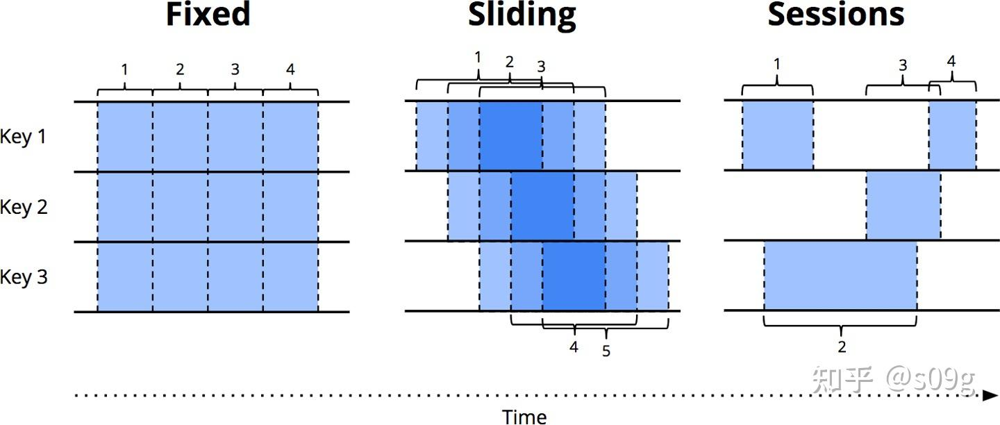

### [流式系统 Chapter 01. Streaming 101](https://zhuanlan.zhihu.com/p/540902592)
#### 什么是Streaming
设计良好的流式计算系统与任何现有的批处理引擎一样，能够产生正确的、一致的、可重复的结果。 

**流式计算:** 一种设计上考虑到了无限的数据集数据处理引擎 

一个数据集的状态由两个重要的（也是正交的）维度来定义：cardinality基数和constitution结构。 

基数决定了数据集的大小，最突出的特点是：   
- 有边界数据：大小有限的数据集
- 无边界数据：大小（至少在理论上）无限的数据集 

constitution结构定义了人们与数据交互的方式。一个直观的感受是，存在两个重要的主要结构:  
- **Table表** 给定时间点上的数据集的整体视角。传统上，SQL系统是以Table为单位进行处理的。
- **Stream流** 随时间演变，针对数据集逐个元素的视角。传统上，MapReduce一系的数据处理系统都是以流的形式处理数据。

#### 流式计算的局限性
流式计算系统一直被归入一个小众场景：提供低，一段时间后，批处理系统逐步提供正确的输出。

对于那些还不熟悉Lambda架构的人来说，其基本思想是，运行批处理系统时并行启动一个流式系统，两者执行基本相同的计算。流式系统给出低延迟、不准确的结果，一段时间后，批处理系统逐步提供正确的输出。

##### Batch和Streaming的效率差异
批处理和流式计算之间的效率差异主要得益于批处理系统中额外的捆绑（increased bundling）和更高效的shuffle传输。现代
处理系统实施了复杂的优化，允许用户使用不多的计算资源来实现到极高的吞吐量水平。我们可以把批处理系统经验迁移到为无边界数据设计的系统上，让用户灵活地选择高延迟、高效率的batch处理和低延迟、低效率的streaming处理。

##### Event Time Versus Processing Time 事件时间vs.处理时间
在任何数据处理系统中，通常有两个我们关心的时间域： 
- **事件时间 Event time：** 事件实际发生的时间
- **处理时间 Processing Time：** 系统观察到事件的时间
大多数（并非全部）使用场景需要关注事件时间。比如随着时间的推移对用户行为进行定性，大多数计费应用，以及各种类型的异常检测。 

理想的环境中，事件时间和处理时间总是一致的，事件一发生就被立即处理。然而，现实并非如此，事件时间和处理时间之间的偏差不仅不是零，而且往往是基于底层输入源、执行引擎和硬件等特性的可变函数。能够影响偏移水平的事情包括以下几点： 

理想的环境中，事件时间和处理时间总是一致的，事件一发生就被立即处理。然而，现实并非如此，事件时间和处理时间之间的偏差不仅不是零，而且往往是基于底层输入源、执行引擎和硬件等特性的可变函数。能够影响偏移水平的事情包括以下几点：
- 共享资源的限制，如网络拥堵、网络分区或非专用(nondedicated)环境下的共享CPU
- 软件原因，如分布式系统逻辑、纷争(contention)等
- 数据本身的特点，如密钥分发、吞吐量的差异或乱序。

因此，如果根据现实世界的系统中绘制事件时间对应处理时间的曲线，最终得到的东西通常看起来有点像图中的红线。

图1-1. Time-domain mapping 时间域映射。x轴代表系统中的事件时间完整性；也就是说，到事件时间中的X时间为止，所有事件时间小于X的数据都被观察到。y轴代表处理时间的进度；也就是数据处理系统执行时观察到的正常时钟时间。

#### Data Processing Patterns 数据处理模式
##### Bounded Data 有边界数据
处理有边界数据在概念上是很简单的，而且大家可能都很熟悉。在图1-2中，我们从左边开始有一个充满熵的数据集。我们通过一些数据处理引擎（通常是批处理，如果是设计良好的流处理引擎也行）来运行它，比如MapReduce，最后在右边有一个新的、更有用的结构化数据集。

图1-2. 用一个经典的批处理引擎进行有边界数据处理。左边的有边界非结构化数据池通过数据处理引擎运行，在右边产生相应的结构化数据。

##### Unbounded Data: Batch 无边界数据: 批处理
###### Fixed windows 固定窗口
使用批处理引擎的重复运行来处理无边界数据集，最常见的方法是将输入数据窗口化为固定大小的窗口，然后将每个窗口作为一个单独的、有边界的数据源来处理（称为tumbling windows滚动窗口），如图1-3。

然而，在现实中，大多数系统仍然有一个完整性的问题需要处理，如果一些事件由于网络分区而在写入到日志的途中被延迟了怎么办？

###### Sessions 会话
会话通常被定义为(对于一个特定的用户)活跃期，终止于一个不活跃的间隙。使用批处理引擎来计算会话时，会话常常会被分割成不同的批次，如图1-4中的红色标记所示。我们可以通过增加批处理量来减少分割的数量，但代价是增加延迟。另一个选择是增加额外的逻辑来拼接之前运行的会话，但代价是进一步的复杂性。

##### Unbounded Data: Streaming 无边界数据: 流处理
流式系统是为无边界数据而生。对于许多现实世界的分布式输入源，数据不仅无边界，而且具备以下特性：
- 在事件时间方面高度无序。如果用户要按照数据发生顺序分析，就需要在管道中进行某种基于时间的shuffle。
- 具有不定的事件时间偏差。用户不能预期在某个固定的时长Y内，看到给定事件时间X的大部分数据。 

在处理具有这些特征的数据时，可以采取一些技巧。我一般将这些方法分为四组：时间无关、近似算法、基于处理时间的窗口和基于事件时间的窗口。

###### Time-agnostic 时间无关
时间无关的处理用于时间不相关的场景，即所有的逻辑都是数据驱动的。基本上现有的所有流系统都支持时间无关的场景。批处理系统也很适合对无边界数据源进行时间无关的处理，只需将无边界数据源切成任意的有边界数据集序列，并独立处理这些数据集。

###### Filtering 过滤
想象一下，你正在处理网络流量日志，用户想过滤掉所有不是来自某个特定域名的流量。用户在每条记录到达时查看它是否属于感兴趣的域名，不属于就丢弃。这类操作只依赖于一个单一的元素，所以无边界无序的数据源与事件时间偏差不具备相关性。

###### Inner joins 内连接
另一个与时间无关的例子是内连接，当连接两个无边界数据源时，如果用户只关心来自两源的元素的连接结果，那么业务逻辑中就没有时间因素。在看到来自第一个源的值时，可以简单地缓存到在持久化状态中；只有在另一个源的值到达时，才发出内联的记录。

###### Approximation algorithms 近似算法
第二大类方法是近似算法，如近似Top-N、流式k-means等。它们接受一个无边界的输入源，并输出数据。如果你仔细看输出的话，这些数据近似符合正确结果，近似算法的优点是，在设计上，它们开销低，并且是为无边界数据而设计。缺点是这类算法不多，而且往往很复杂，并且它们的近似性质影响了它们的效用。

###### Windowing 窗口化
- **Fixed windows (aka tumbling windows) 固定窗口（又称滚动窗口）**固定窗口将时间切成具有固定大小时间长度的片段
- **Sliding windows (aka hopping windows) 滑动窗口（又称跳动窗口）**作为固定窗口的泛化，滑动窗口由一个固定的长度和一个固定的周期来定义。
- **Sessions 会话** 作为动态窗口的一个例子，会话是由一系列的事件组成的，以大于某个超时的不活动间隙为终点。会话通常将一系列时间上相关的事件组合在一起来分析用户在一段时间内的行为。会话的长度不能被先验地定义；它们取决于所涉及的实际数据。 

图1-8. 窗口化策略。每个例子都显示了三个不同的键，展示了aligned windows对齐窗口（适用于所有数据）和unaligned windows非对齐窗口（适用于数据的一个子集）之间的区别。

###### Windowing by processing time 按处理时间窗口化
当按处理时间窗口化时，系统将传入的数据缓冲到窗口中，直到一定的处理时间过去。例如，在5分钟固定窗口的情况下，系统将缓冲数据5分钟处理时间，之后它将把在这5分钟内观察到的所有数据作为一个窗口，发送到下游进行处理。 

按处理时间窗口化有几个不错的特性： 

- 简单。实现起来非常简单，不用担心洗数据的问题。只需在数据到达时进行缓冲，并在窗口关闭时将它们发送到下游。
- 直白地判断窗口的完整性。因为系统清楚地知道一个窗口的所有输入是否被观察到，可以对一个给定的窗口是否完整做出判断。这意味着在通过处理时间进行窗口化时，不需要处理"迟到"的数据。

但是处理时间窗口化有一个非常大的缺点：如果这些数据与事件时间相关，那么这些数据必须按事件时间顺序到达，处理时间窗口才能反映真实发生的事件。不幸的是，在现实世界的分布式输入源中事件时间顺序的数据并不常见。

###### Windowing by event time 按事件时间窗口化
当用户需要用有限的、反映事件实际发生时间的区域来观察一个数据源时，就会使用事件时间窗口化。鉴于我们不知道获得某个窗口的所有数据的确切时间，那要怎么知道这个窗口的结果什么时候可以获得？事实上，我们根本不知道。对于许多类型的输入，系统可以通过类似于MillWheel、Cloud Dataflow和Flink中的watermark水印对窗口的完成性给出准确的启发式估计。但对于绝对正确性非常重要的情况（比如计费），唯一真正的选择是为管道创建者提供一种方法，以表达他们希望窗口的结果何时被实现，以及这些结果应如何随着时间的推移而被完善。

### [流式系统 Chapter 01. Streaming 102](https://zhuanlan.zhihu.com/p/59993580)
#### When：水位线
水位线是事件时间中输入完整性的时间概念。换句话说，它们是系统根据当前处理的数据的事件时间判断处理进度和完整性的方法。 
在图1.1中，红色的Reality线本质上就是水位线。随着处理时间的推移，它跟踪事件时间完整性的进度。在概念上，可以将水位线视为函数 F(P) -> E，在处理时间中选取一个点，返回事件时间的一个点。更准确地说，对函数的输入实际上是在 Pipeline 中观察到水位线的点上游的一切的当前状态：输入源，缓冲数据，正在处理的数据等；但在概念上，将其视为从处理时间到事件时间的映射更简单。在事件时间点 E 上系统会认为事件时间小于 E 的所有数据都到齐了。
- **理想的水位线：**在完全了解所有输入数据的情况下，可以构建理想的水位线；在这种情况下，没有延迟数据；所有数据都提前或准时到达。
- **启发式水位线：**对于许多分布式输入源，完全了解输入数据是不切实际的，在这种情况下，最佳选择是提供。启发式的水位线使用任何有关输入的信息（分区，分区内排序，文件增长率等），以提供尽可能准确的进度估计。即使如此，使用启发式水位线意味着它有时可能是不正确的的，这将导致有些数据被划分为延迟数据。我们将在下面的触发器部分中了解如何处理延迟数据。
- **太慢：**当任何类型的水位线，由于已知的未处理数据（例如，由于网络带宽约束而缓慢增长的输入日志）被正确地延迟时，如果结果的计算只依赖水位线的触发，将直接导致输出结果的延迟。
- **太快：**当一个启发式水位线比实际的水位线更快的向前推进时，会导致原来没有延迟的数据变成了延迟数据。

#### When：触发器
触发器用来表明在处理时间的什么适合该计算窗口的结果。用于触发的信号的示例包括：
- **水位线进度（即事件时间进度）**当水位线通过窗口的末尾时，计算结果并输出
- **处理时间进度**可以用于提供固定的周期更新，因为处理时间（不像事件时间）总是均匀地，没有延迟地进行。
- **元素计数**可以用于在窗口积累固定数量的元素后触发。
- **带标记的，或其他数据依赖触发器**即记录或记录的特性（例如，EOF元素或刷新事件）意味着需要产生输出的地方。 

考虑解决水位线太慢或太快的问题，在这两种情况下，我们希望在水位线超过窗口末尾之前或之后能够有机会计算窗口的结果，并能够提供持续更新的机制（除了水位线超过窗口末尾那一刻）。 

在**太慢**的情况下（即提供提前的推测结果），我们可能应该假设任何给定的窗口可能有稳定的输入数据，因为我们知道（通过窗口的早期阶段），我们观察到的这个窗口的输入是非常不完整的。因此，当处理时间提前（例如，每分钟一次）时周期性地触发可能是明智的，因为触发发射的数量将不依赖于实际观察到的窗口的数据量；在最坏的情况下，我们只会得到稳定的定期触发发射。 

在**太快**的情况下（即，由于启发式水位线可能存在错误的推测，所以需要一种机制去能够处理延时数据去修正计算结果），假设水位线基于相对准确的启发式（通常是相当安全的假设）。在这种情况下，预计不会经常看到延迟很久的数据，但是在实际中确实存在挺多延迟数据，不过结果很快会得到修正。每收到1个延时数据触发一次的策略，能够让我们更快的修正更新计算结果，但是由于预期的后期数据不频繁，应该不会给系统带来大的冲击。请注意，这些只是示例：如果有不同的应用场景，可以自由选择不同的触发器（或选择不适用触发器）。 

#### When: 最大允许延迟（超过即可回收）
任何现实世界的无序处理系统都需要提供一些限制其正在处理的窗口的生命周期的方法。最简洁的实现方在系统内定义一个最大允许延迟的边界，即限制任何给定记录最晚到达时间（相对于水位线时间）不能超过这个时间；任何超过这个时间的数据不再处理，直接丢弃掉。定义了最大允许延迟之后，还需要准确地确定窗口需要保留的时间：直到水位线超过了窗口的末尾时间+最大允许延迟时间[5]。允许系统丢弃超过最大延迟的数据，还能够节省系统的计算资源。

#### How: 累积
随着时间推移，触发器被用于为一个窗口生成多个窗格，我们发现自己面临最后一个问题：“如何随着时间修正结果？”
- **丢弃：**每当窗格计算完毕时，任何存储的窗口状态都将被丢弃。这意味着每个窗格与之前的窗格都是相互独立的。
- **累积：**每当窗格计算完毕时，保留该窗格所有的状态，未来输入的数据会累积到并更新现有状态。这意味着窗格是建立在前面窗格的基础之上的。以后的结果可以简单地覆盖以前的结果
- **累积和撤回：**和累积模式一样，但是当生成新窗格时，同时会为前一个窗格生成1个独立的撤回。撤回（与新的累积结果一起）本质上是在表达，“我以前告诉过你的结果是X，但我错了。撤回我上次告诉你的X，并将其替换为Y。
