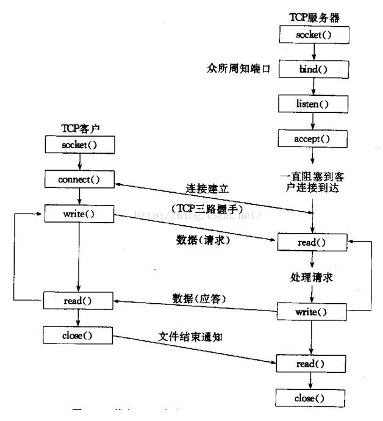

### socket编程
下图为tcp套接字编程流程

- 创建套接字──socket()
- 指定本地地址──bind()
- 建立连接──connect()
- 等待客户端的连接请求──accept()
- 监听连接──listen()，返回一个文件句柄，由accept监听该文件句柄
- 数据传输──read()与write()
- 关闭套接字──close()

### IO多路复用
#### select

#### poll

#### epoll
